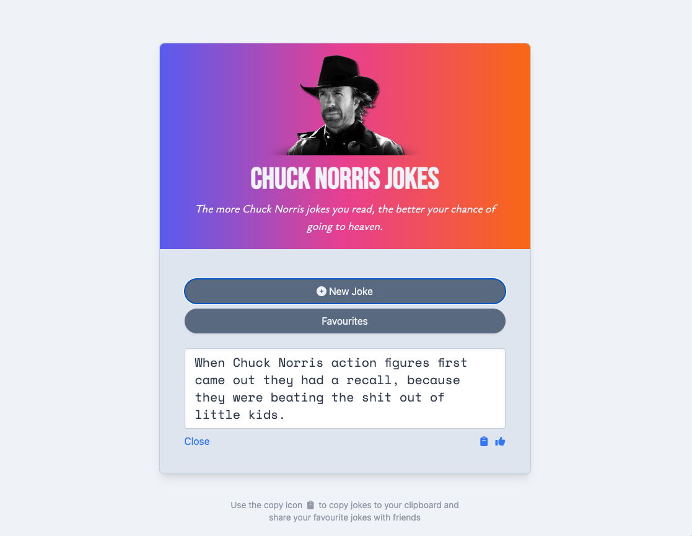

# Chuck Norris Jokes Generator

## Simple joke generator

This is a simple Chuck Norris jokes generator. I made this with HTML, JavaScript and styled with TailwindCSS.

 

**Table of Contents:**

* [Usage](#usage)
* [Screenshots](#screenshots)
* [Credits](#credits)
* [License](#license)

 

# Usage

Generate random Chuck Norris jokes by clicking the `New Joke` button. If you like the generated joke, you can click the `thumbs-up` icon to save the joke to favourites or, click the `clipboard` icon and copy the joke to share with friends.

Visit the application here: https://shaky411.github.io/chuck-norris/

 

## Screenshots

 

## Credits

Jokes come are generated by the following api: https://api.chucknorris.io/

 

## License

* _This application has the MIT Licence_
For more info, please go to the [licence description](https://opensource.org/license/mit/)
